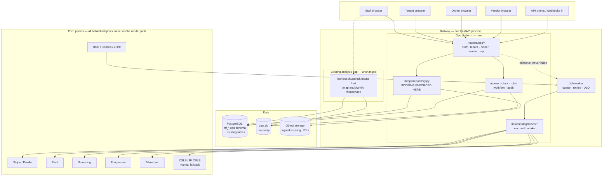

# ARCHITECTURE.md — recommended target

Written by Phase 0 on **2026-08-26**. Read `STACK.md` first for the observed facts this
rests on.

---

## 1. The recommendation, and its cost

**Build the ops platform inside `market-pulse-v21/` as a separate schema namespace and a
separate route tree, sharing the process, the database instance, and the deploy — but
not the authorization model, not the money types, and not the tables.**

The host repo was chosen by the owner. Phase 0's remaining job is to say honestly what
that choice costs and where the seams must go, rather than to agree with it.

### What the choice buys

- **A Postgres instance and a working deploy already exist** on Railway, with a migration
  idiom proven against Railway's connection quirks (`database.py:_get_conn` retry loop).
- **Real domain assets are already here** and would otherwise be rebuilt: the rent ladder
  (ZORI/SAFMR/FMR/ACS with provenance per tier), `zips.db`, FHA/PITI and state tax and
  insurance tables, regional hazard data. Phase 5 needs a market-rent comp; Phase 10 needs
  flood and earthquake context; Phase 14 needs underwriting. Those exist.
- **One deploy, one domain, one session cookie.** Staff already sign in here.

### What the choice costs — say it out loud

- **The existing app's two worst habits cannot be inherited.** It stores money as floats
  and enforces access per-route. Both are fine for an analysis tool over public filings.
  Neither is acceptable for a rent ledger or a legal notice. The ops platform therefore
  needs its own money types and its own authorization layer *inside the same process*,
  which is more discipline than a greenfield service would need, not less.
- **`main.py` is already ~5,900 lines.** Fifteen phases of routes appended to it produces
  something nobody can review. The ops platform must get its own router package from day
  one — see §3.
- **Blast radius couples.** A bad deploy takes down the investing boards and the tenant
  portal together. Acceptable at this scale; worth revisiting if tenants ever depend on
  it for rent payment uptime.
- **One database instance, two workloads.** The analysis boards run heavy read queries.
  The ledger needs consistent low-latency writes. At current scale this is fine. The
  seam in §2 is drawn so that splitting later is a config change, not a rewrite.

### The alternative, rejected

A separate service sharing auth via the existing session cookie would give cleaner
isolation and let the ops platform pick its own stack. It was rejected because it doubles
the deploy and secret surface for a single operator, and because the domain assets listed
above would have to be exposed over an API that does not exist yet. Revisit if a second
engineer joins or if tenants start paying rent through it in volume.

---

## 2. The seam — how the two halves stay apart in one process

This is the load-bearing decision of the whole build.

| | Analysis side (existing) | Ops side (new) |
|---|---|---|
| tables | `pm_*`, `hh_*`, `landscaper_*`, `user_prices`, … | **`mf_*` prefix, no exceptions** |
| money | `DOUBLE PRECISION` — an estimate | `BIGINT` cents + `currency CHAR(3)` |
| dates | `DATE` / naive timestamps | `timestamptz` for events, `DATE` in property-local tz for legal dates |
| access | per-route `_admin_gate()` | mandatory scoping layer, every query |
| audit | none | every read of PII, every write |
| tests | domain `check()` suites | same harness, plus an authorization matrix |

**Enforcement, not convention.** Three mechanical guards, all cheap:

1. A test that greps the ops migrations and fails on `DOUBLE PRECISION`, `REAL`, `FLOAT`,
   or `NUMERIC` in any `mf_*` table.
2. A test that asserts every `mf_*` table is reachable only through
   `lib/ops/repository.py` — no raw `conn.execute` against an `mf_*` table outside it.
3. A test that enumerates every route under `/ops` and asserts each is registered with an
   explicit scope declaration. A route with no declared scope fails the suite rather than
   defaulting to open, which is how `_admin_gate` fails today.

Guard 3 is the answer to CLAUDE.md's "data layer, not UI routing". Postgres row-level
security is the textbook answer, but this app connects as a single database user with a
per-call connection and no session context, so RLS would require plumbing a
`SET LOCAL app.current_user` into every checkout. That is worth doing eventually and is
in `BACKLOG.md`; for Phase 1 the repository layer plus the enumeration test gives the
same guarantee with far less that can go subtly wrong.

---

## 3. Module layout

```
market-pulse-v21/
├── main.py                   # existing routes stay; mounts the ops router, ~10 lines added
├── database.py               # existing; gains _ensure_mf_tables() call in init_db()
├── lib/
│   └── ops/
│       ├── repository.py     # THE ONLY path to mf_* tables. Scoping enforced here.
│       ├── scope.py          # role → visible rows, per entity type
│       ├── money.py          # integer-cent type, parsing, formatting, arithmetic
│       ├── clock.py          # TimeService + JurisdictionClock
│       ├── rules.py          # jurisdiction_rules lookup: rule × jurisdiction × date
│       ├── audit.py          # append-only writer
│       ├── workflow.py       # template/instance engine (Phases 3, 6, 7, 14 reuse it)
│       ├── jobs.py           # queue abstraction + worker entrypoint
│       ├── storage.py        # object storage, signed expiring URLs
│       └── integrations/     # one adapter per vendor, each with a fake
│           ├── payments.py       stripe | dwolla
│           ├── screening.py      transunion smartmove
│           ├── esign.py          docusign | dropbox sign
│           ├── banking.py        plaid
│           ├── address.py        usps | smarty
│           ├── comms.py          email + sms
│           └── licenses.py       cslb / ri crlb — manual-fallback adapters
├── routers/
│   └── ops/                  # NOT main.py. staff.py, tenant.py, owner.py, vendor.py, api.py
├── templates/ops/            # own base template, own nav
└── tests/
    ├── test_ops_money.py
    ├── test_ops_clock.py
    ├── test_ops_rules.py
    ├── test_ops_authz.py     # the role × entity × action matrix
    └── test_ops_schema.py    # the three mechanical guards above
```

`market-pulse-v21/main.py` gains one `include_router` call per portal and nothing else.

---

## 4. Target architecture



### Portal separation
One identity system, four entry points, four scopes. `/ops/staff`, `/ops/portal`
(tenant), `/ops/owner`, `/ops/vendor`. Separate templates and separate base layouts, so
a tenant never renders a component that could leak a staff-scoped field. The scope is
attached at session creation and re-derived per request from the database, never trusted
from the cookie payload.

### Job runner
Postgres-backed queue (a `mf_jobs` table with `SELECT … FOR UPDATE SKIP LOCKED`) rather
than Redis. One fewer service to run, transactional with the writes that enqueue, and
adequate to several orders of magnitude beyond this portfolio's volume. Worker runs as a
second Railway process off the same image.

### Object storage
Railway volumes are not durable enough for lead certificates and move-in photos that
decide deposit disputes. Use S3-compatible storage (Cloudflare R2 or Backblaze B2 for
cost) behind `lib/ops/storage.py`, signed expiring URLs only, no public bucket, SHA-256
recorded at upload for tamper evidence.

---

## 5. What Phase 1 must deliver before any feature is safe

In priority order, because CLAUDE.md's acceptance criteria depend on all of them:

1. `lib/ops/money.py` and the schema guard — cents everywhere, provably.
2. `lib/ops/clock.py` — `TimeService` and `JurisdictionClock`. Nothing in ops calls
   `datetime.now()`. Legal dates resolve through the property's jurisdiction.
3. `lib/ops/repository.py` + `scope.py` + the route-enumeration test.
4. `mf_audit_log` with an insert-only grant and a trigger blocking update/delete.
5. MFA for `platform_admin` and `division_manager`.
6. `mf_jobs` queue with retries and a dead-letter path.
7. `lib/ops/storage.py` with signed URLs.
8. A down-migration path, which `CREATE TABLE IF NOT EXISTS` does not currently provide.

---

## 6. Open questions that change architecture — for the owner, before Phase 4

Both are named in the source plan and both are genuinely blocking. Neither is a
software decision.

- **Broker licensing.** Managing property for third-party owners generally requires a
  real estate broker licence in California, and Rhode Island has its own regime. The
  `owner_client` role in CLAUDE.md implies third-party owners. If the answer is "we only
  manage our own entities", the owner portal is a reporting convenience and the
  architecture is unchanged. If third-party management is intended, it changes what the
  platform may do and what records it must keep.
- **Trust accounts.** Holding owner or tenant funds implies trust-account rules and
  segregation. Phase 4 is designed to avoid custody entirely — funds settle processor to
  ownership-entity account, and the platform never holds a balance. That design must be
  confirmed as the intent before Phase 4, because reversing it later is a rewrite of the
  ledger, not a feature.

A third, added by Phase 0 and not in the source plan:

- **Timing risk on San Leandro.** The source plan states the ordinance takes effect
  1 January 2027 with registration as a precondition to *any* rent increase. Today is
  26 August 2026. If registration opens before Phase 5 ships, that is a manual deadline
  the platform will not catch for you. Phase 5's research must establish the registration
  window as its first output, not its last.
